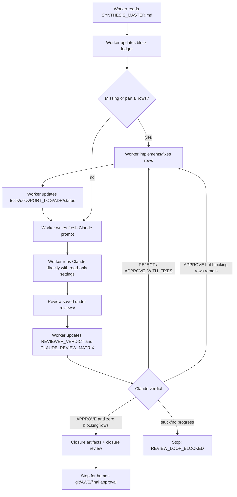

# CLI Worker Review Loop Flow

## Actors

| Actor | Role | Must not do |
|---|---|---|
| Codex worker | Implement block rows, update ledgers/docs/tests, create fresh Claude prompt | Run Codex review, run nested Codex, run AWS, silently close block |
| Claude review command/helper | Launch Claude, save raw output | Judge code quality itself, approve scope, commit/push |
| Claude reviewer | Independently reconstruct scope and review evidence | Edit files, run Codex, spend AWS |
| User | Approve risky gates: AWS, defer/drop, final ready-for-testing, git close/tag | Babysit every normal fix loop |

## Normal Block Loop



## Fresh-Review Rule

A Claude review is valid only for the prompt and artifact state it reviewed.

Run a new review when any of these changed:

- code
- tests
- ledger disposition/counts
- `PORT_LOG`
- `V5_DESIGN_DECISIONS`
- `WORKER_SELF_REVIEW`
- `STATUS`
- `TESTS`
- reviewer prompt itself

Use a fresh iter number and save stdout/stderr under `reviews/` and `logs/`.

## Current Block A Example

Correct current loop:

```text
iter1: Claude approved ledger audit only
worker implemented A-16/A-17/A-21/A-25
iter2: Claude caught stale prompt / no usable verdict
worker updated prompt to include A-21 and no-plan-file instruction
iter3-iter5: CLI handoff attempts exposed prompt/permission issues
new design: worker-led direct Claude review using CLAUDE_REVIEWER_BASE_PROMPT.md
```
