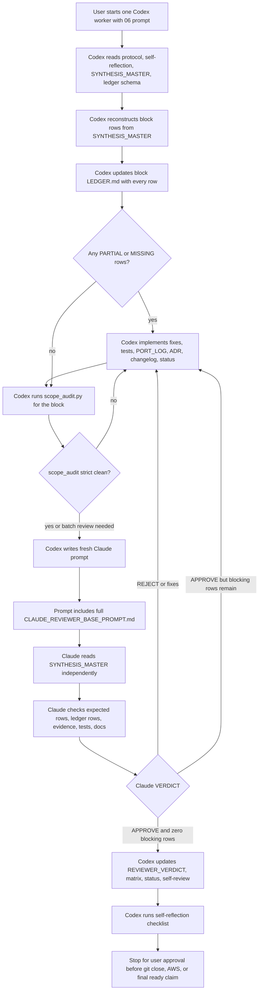

# Worker Reviewer Decision

Status: ACTIVE DECISION RECORD
Created: 2026-05-04

This document answers one question:

> Who does the v5.0.1 redo work, and who independently reviews it?

## Current Decision

For the current v5.0.1 redo, use:

| Role | Tool | Model/Effort | Why |
|---|---|---|---|
| Worker | Codex CLI | GPT-5.5 high | Implement code/tests/docs/ledgers and coordinate the loop |
| Independent reviewer | Claude Code CLI | Opus/high | Reconstruct scope independently from `SYNTHESIS_MASTER.md` |

Current worker prompt:

`compact_v5/_status/v5_completion_audit/06_CODEX_WORKER_SELF_COORDINATED_PROMPT.md`

Current reviewer base:

`compact_v5/_status/v5_completion_audit/CLAUDE_REVIEWER_BASE_PROMPT.md`

## Why This Is The Current Choice

The latest failure mode was not "bad code review only." It was scope drift:
agents reviewed a narrowed prompt instead of the full `SYNTHESIS_MASTER.md`
scope.

The current design prevents that by combining:

- full per-block ledgers
- `scope_audit.py` mechanical row gate
- `PS_AGENT_SELF_REFLECTION.md` before done/ready claims
- Claude reviewer base prompt requiring independent scope reconstruction
- saved prompts, raw reviews, logs, verdicts, matrix rows, and status files

## Current Flow

## Anti-Drift Controls

| Control | Prevents |
|---|---|
| `SYNTHESIS_MASTER.md` row reconstruction | Worker cannot define its own smaller scope |
| Per-block `LEDGER.md` | Every row must have a disposition |
| `scope_audit.py` | Mechanical block if expected rows are absent or blocking |
| `verify_scope_completeness.ps1` | Strict wrapper for close gates |
| `CLAUDE_REVIEWER_BASE_PROMPT.md` | Claude reviewer must re-read canonical scope |
| `PS_AGENT_SELF_REFLECTION.md` | No done/ready claim without per-item evidence |
| Raw `prompts/`, `reviews/`, `logs/` | Claims can be audited after the fact |
| `CLAUDE_REVIEW_MATRIX.md` | Review count and verdict state stay visible |
| Progress-based stuck guard | Prevents endless loops without limiting useful review |

## Review Loop Policy

There is no fixed maximum number of useful worker/reviewer iterations.

The goal is to get enough review, not to stop review early. Continue review/fix
cycles as long as each cycle adds meaningful implementation progress, clearer
evidence, better tests, or a resolved reviewer finding.

Count every Claude handoff attempt, including unusable outputs such as
`NO_VERDICT`, stale-prompt reviews, plan-mode output, empty files, and real
reject/fix verdicts. This is for audit visibility, not as a hard cap.

Stop only when the loop is stuck:

- 3 consecutive reviewer handoff failures means stop and write
  `REVIEW_LOOP_BLOCKED.md`.
- 3 attempts on the same row, same finding, or same failing test without
  meaningful change means stop and write `REVIEW_LOOP_BLOCKED.md`.
- More reviews are encouraged when each review is checking new evidence or a
  materially improved implementation.

If stuck:

1. Stop implementation for that block.
2. Write `blocks/<BLOCK>/REVIEW_LOOP_BLOCKED.md`.
3. Update `blocks/<BLOCK>/STATUS.md` and `ledger/CLAUDE_REVIEW_MATRIX.md`.
4. Ask the user whether to continue, split the block, change strategy, or
   switch worker/reviewer mode.

## Disagreement Rule

Codex may disagree with a Claude finding, but it may not override Claude
silently.

Required dispute flow:

1. Codex records the finding as unresolved.
2. Codex writes `DISPUTED_FINDING` with exact file:line/test evidence.
3. Codex sends a fresh Claude dispute-review prompt.
4. The dispute prompt includes the full `CLAUDE_REVIEWER_BASE_PROMPT.md`.
5. Claude rereads canonical context from disk and reconstructs scope from
   `SYNTHESIS_MASTER.md`.
6. Claude returns `WITHDRAWN`, `UPHELD`, or `NEEDS_MORE_EVIDENCE` for each
   dispute.

The finding remains ship-blocking unless Claude withdraws it, Codex fixes it,
or the user explicitly decides.

## Alternate Mode: Claude Worker, Codex Reviewer

This is possible, but it is not the current active v5 redo policy.

Use it only if the user explicitly switches the redo to Claude-worker mode.

| Role | Tool | Required changes |
|---|---|---|
| Worker | Claude Code CLI | Claude must follow the same ledgers, scope audit, and self-reflection gates |
| Independent reviewer | Codex CLI | The current "Codex worker-only" rule must be replaced for that mode |

If switching to this mode, update these files first:

- `README.md`
- `STATUS.md`
- `04_COMMANDS.md`
- `06_CODEX_WORKER_SELF_COORDINATED_PROMPT.md` or a new Claude-worker prompt
- `CLAUDE_REVIEWER_BASE_PROMPT.md` or a new Codex reviewer base
- `PS_CLI_WOKER_DESIGN/`

Do not mix both policies in one run. Mixed policy creates audit confusion.

## Decision Rule

Pick one pair per redo run:

| Worker | Reviewer | Allowed? | Notes |
|---|---|---|---|
| Codex | Claude | YES, current active path | Use `06_CODEX_WORKER_SELF_COORDINATED_PROMPT.md` |
| Claude | Codex | YES, only after explicit policy switch | Requires updated docs/prompts |
| Codex | Codex | NO | Not independent enough for this failure mode |
| Claude | Claude | NO | Not independent enough for this failure mode |
| Any worker | no reviewer | NO | Scope drift recurrence risk |

## What Is Already Documented

| Document | Purpose |
|---|---|
| `compact_v5/_status/PS_CRITICAL_WORKER_PROBLEM.md` | Initial v5 scope-narrowing incident |
| `compact_v5/_status/PS_AGENT_SELF_REFLECTION.md` | Mandatory pre-done checklist |
| `compact_v5/_status/scripts/scope_audit.py` | Mechanical scope audit |
| `compact_v5/_status/CODEX_REVIEW_TEMPLATE.md` | Codex reviewer AXIS D template for alternate mode/history |
| `compact_v5/_status/v5_completion_audit/CLAUDE_REVIEWER_BASE_PROMPT.md` | Current Claude reviewer anti-drift base |
| `compact_v5/_status/v5_completion_audit/PS_CLI_WOKER_DESIGN/` | Current process design docs |
| `D:/Github/Learning_Factory/docs/LF_LESSON_AGENT_SCOPE_DRIFT.md` | Generalized engineering lesson for future projects |

## Current Recommendation

Continue with Codex worker plus Claude reviewer.

Reason: the active v5 audit folder is already organized around that mode, the
Claude reviewer base prompt is already written, and `scope_audit.py` now gives
both tools a mechanical row-scope gate.
